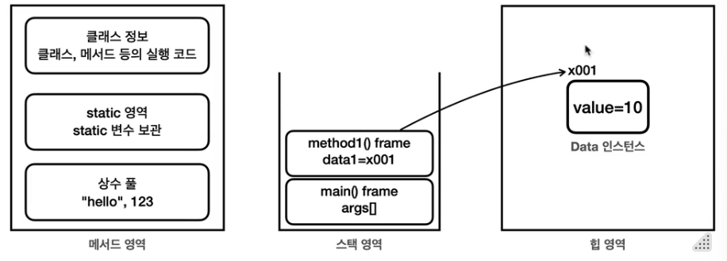

# 섹션7: 자바 메모리 구조와 static

## 1. java 메모리 구조



- 클래스 정보, 생성자, 메서드 등 모든 실행 코드는 메서드 영역에 존재


- 생성자를 호출하면 heap 영역에 인스턴스 변수들이 저장되고, stack 영역에 지역변수에 주소값 생성


- 메서드 영역의 method 코드는 공통, 그걸 적용하는 것은 호출하는 x002 인스턴스 내부이기 때문에 힙 영역을 먼저 거치고 그 안에서 메서드 영역의 메서드를 호출

## 2. Static 변수

*** Static이 필요한 이유**

```jsx
package week3.static1;

public class DataCountMain2 {

    public static void main(String[] args) {
        Counter counter = new Counter(); //counter는 참조값 c001대입, c001(counter).count = 0으로 초기화
        Data2 data = new Data2("A", counter); //data는 참조값 d001대입, d001.name="A", c001.count = 1이 됨
        System.out.println("A count = " + counter.count);
        System.out.println("data의 참조값은 " + data);
        System.out.println("counter의 참조값은 " + counter);

        Data2 data2 = new Data2("B", counter); //data2는 참조값 d002대입, d002.name="B", c001.count = 2가 됨
        System.out.println("B count = " + counter.count);
        System.out.println("data2의 참조값은 " + data2);
        System.out.println("counter의 참조값은 " + counter);

    }
}
```

- 인스턴스는 생성할 때마다 각자의 변수들을 가지는데, 이 때 인스턴스마다 공유할 수 있는 변수가 필요하다고 가정
- Counter라는 퍼블릭 클래스를 통해 count값을 공유하는 코드
- 이를 static 키워드를 통해 한 클래스에 공유 변수를 만들 수 있다 = 클래스 변수라고도 부름

```jsx
package week3.static1;

public class Data3 {
    public String name;
    public static int count; //static변수 선언

    public Data3(String name){
        this.name = name;
        count++; //Data3.count라고 명시할 수도 있음
    }
}
```

- static 변수는 메소드 영역 내의 static 영역에 메모리 할당됨
- 클래스 변수이기 때문에 모든 인스턴스에서 호출할 수 있으므로 인스턴스를 통해 호출할 수 있지만, 인스턴스 변수와 혼동될 수 있으므로 클래스를 통해서만 호출하자!

```jsx
data3.staticCall(); //인스턴스로 클래스 메소드를 호출할 수는 있으나, 코드상 해석이 혼동되기 때문에 사용하지 않음
DecoData.staticCall();
```

*** 변수의 생명주기 - 지역<인스턴스<클래스**

- 지역 변수: 스택 영역 ⇒ 메서드 종료시 제거
- 인스턴스 변수: 힙 영역 ⇒ GC 발생 전까지는 생존
- 클래스 변수: 메서드 영역 ⇒ JVM이 클래스 로딩하고 JVM 종료까지 생명주기 이어짐

## 3. Static 메소드

```jsx
package week3.static2;

public class DecoUtil1 {

    public String deco(String str){
        String result = "*" + str + "*";
        return result;
    }
}
```

```jsx
package week3.static2;

public class DecoMain1 {

    public static void main(String[] args) {
        String s = "hello java";
        DecoUtil1 utils = new DecoUtil1();
        String deco = utils.deco(s); //*hello java*

        System.out.println("before: " + s);
        System.out.println("after: " + deco);
    }
}
```

- 클래스의 기능을 사용하기 위해 인스턴스를 생성해서 인스턴스마다 호출해서 사용하고 있음
- 인스턴스를 통해서가 아니라, 인스턴스없이 바로 클래스 기능에 직접적으로 접근해서 사용하고 싶음
- Q. String method() 형태가 뭐지..? 문자열을 처리하는 함수 기능..?? 낯설다 ..

```jsx
package week3.static2;

public class DecoUtil2 {

    public static String deco(String str){
        String result = "*" + str + "*";
        return result;
    }
}
```

```jsx
package week3.static2;

public class DecoMain2 {

    public static void main(String[] args) {
        String s = "hello java";
        String deco = DecoUtil2.deco(s);

        System.out.println("before: " + s);
        System.out.println("after: " + deco);
    }
}
```

- static으로 메소드를 선언하면 인스턴스없이 클래스로 접근하여 호출이 가능
- 보통, static 메소드 내부에서 인스턴스 변수 등을 사용하지 않음 ⇒ 인스턴스 변수를 사용하려면 참조값을 통해 들어가야 되는데 static 메소드는 클래스 메소드이기 때문에 인스턴스의 참조값을 받지 않기 때문

<aside>
💡 그러나 매개변수를 통해 참조값을 전달하면 **정적 메소드에서도 인스턴스 변수를 사용**할 수 있다!

</aside>

```jsx
    //인스턴스의 참조값을 매개변수로 받아서 사용해보자
    public static void staticCallbyIns(DecoData data) {
        data.instanceValue++; //인스턴스 변수 접근
        data.instanceMethod(); //인스턴스 메서드 접근
    }
```

```jsx
DecoData data2 = new DecoData();
DecoData.staticCallbyIns(data2);
```

*** import static ?**

- `import static week3.static2.DecoData.*` : static으로 선언된 애들을 class를 통해 호출하는 것이 아닌 생략해서 접근할 수 있도록 함

*** main 메소드는 정적 메소드!**

- 정적 메소드는 인스턴스 메소드를 호출할 수 없음
- 따라서 메인 메소드에서도 정적 메소드만 호출이 가능함
