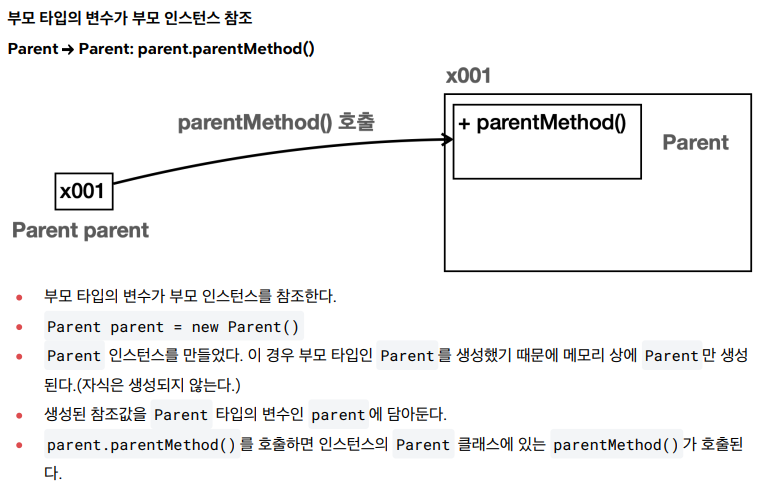

# 섹션10: 다형성1

### 1. 다형성을 이해하기 위한 선수지식

- **다형적 참조**
    - parentMethod 또한 Child 인스턴스에 Parent 클래스 정보가 생성되어 있으므로 호출 가능
    - `Parent parent1 = new Parent()`
    - `Child child1 = new Child()`
    - 그러나 Parent 타입의 변수로 Child 인스턴스를 생성 가능
    - `Parent poly1 = new Child()`
    
    1. **Parent 타입의 변수가 Parent 인스턴스를 참조할 때**
    
    
    
    - Parent 인스턴스를 생성했으므로, 메모리에 Parent 클래스 정보들이 생성
    - 생성된 참조값을 그저 Parent 타입의 변수인 parent에 담아두는 것
    
    1. **Parent 타입의 변수가 Child 인스턴스를 참조할 때**
    
    
    
    - Child 인스턴스를 생성했으므로, 메모리에 Parent를 상속받은 Child 클래스 정보들이 생성
    - Child child1 = new Child() 와 어떤 게 다른가?
        - 생성된 참조값을 Parent 타입의 변수인 parent에 담아두었으므로, 메소드를 호출할 때 자신의 타입과 동일한 Parent 타입의 메소드를 호출함
        - 단, child의 메소드는 호출할 수 없음 ⇒ “다운캐스팅”을 통해 가능하게 함
        - 부모 타입으로 자식 인스턴스를 생성할 수 있다는 건 알겠지만, 자식 타입으로 자식 인스턴스를 생성하면 child 메소드도 parent 메소드도 호출할 수 있는데, 굳이 부모 타입으로 자식을 생성하는 다형적 참조를 하는 이유는 뭘까?
        - ⇒ 다형성의 다른 이론을 알아야 함
        
    - 다운캐스팅
    
    ```jsx
    package week5.poly.basic;
    
    public class CastingMain1 {
    
        public static void main(String[] args) {
            //부모 타입으로 자식 인스턴스 참조 : 다형적 참조
            Parent poly = new Child(); //x001
            //이 때 상속은 아래가 위를 물려받은 것이므로,
            //위에서 아래의 정보는 없으므로 자식의 메소드는 호출 불가능
            //이를 다운 캐스팅을 통해 부모가 자식을 호출하도록 만들 것임
    
            //1. 다운캐스팅
            //child타입의 변수를 하나 더 만들어서 poly에 담긴 참조값을 복사
            //그렇게 타입이 다운된 child를 통해서 child 메소드를 호출
            Child child1 = (Child) poly; //x001
            child1.childMethod();
            //캐스팅(Child)로 parent 타입을 Child로 바꾼 후, 그걸 Child 타입의 child 변수에 담는다
            //새로운 변수에 담는 것이므로 poly 자체가 변하는 게 아님
    
            //2. 일시적 다운캐스팅
            //새로운 변수에 담는 게 번거로움 => 자식 메소드를 호출하는 순간만 다운캐스팅
            ((Child) poly).childMethod();        
    
        }
    }
    ```
    
    - 다운캐스팅을 통해 child타입의 변수에 poly를 담고 child 메소드를 호출
    - 그러나 child타입의 변수를 새로 만드는 것이 번거로우므로, 변수를 생성하지 않고 일시적 다운캐스팅을 통해 메소드만 호출해서 사용하기도 함
    
    1. **업캐스팅**
    
    
    
    - new C()로 인스턴스를 생성하면, 상속받는 A,B까지 다 생성됨
    - 따라서 타입을 up해도 모두 C를 참조할 수 있음
    - A타입으로도 B타입으로도, C 인스턴스에는 A,B의 정보가 있으므로 참조 가능
    
    1. **다운캐스팅**
    
    
    
    - new B()로 인스턴스를 생성하면, 상속받은 A밖에 생성이 안됨
    - 따라서 A타입으로 up해서 B를 참조할 수 있지만,
    - C타입으로 down해서 B를 참조할 수 없음
    - 부모인 B는 자식인 C의 정보가 없기 때문
        - 이 때, `C c = new B()` 처럼 C타입으로 B인스턴스를 생성하려고 하면 컴파일 에러를 발생시키지만,
        - `C c = **(C)** new B()` 처럼  C타입으로 다운캐스팅한 B인스턴스를 생성하면 런타임 에러가 발생한다.
        - 컴파일에러는 프로그램 실행 전에 발생하므로 개발 즉시 고칠 수 있어 안전하고 좋은 오류지만, 런타임에러는 프로그램 실행 중에(서비스 실행 중에) 발생하므로 매우 위험한 오류이다.
    
- **메서드 오버라이딩**
    
    
    
    - `Parent poly = new Child()`
    - parent 타입으로 Child를 참조 ⇒ 다형적 참조
    - 이 때, method()를 호출하면 parent 타입에서 찾았다가, 오버라이딩 체크 후 오버라이딩 된 Child의 method를 호출하게 됨
