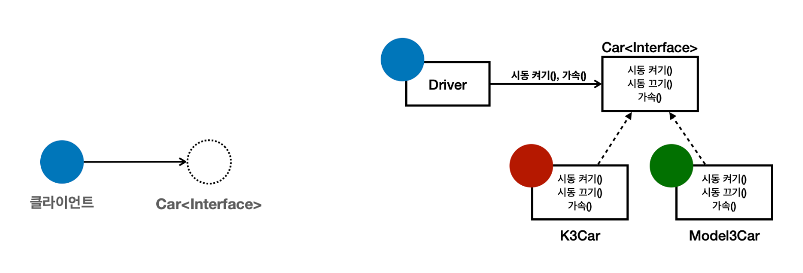
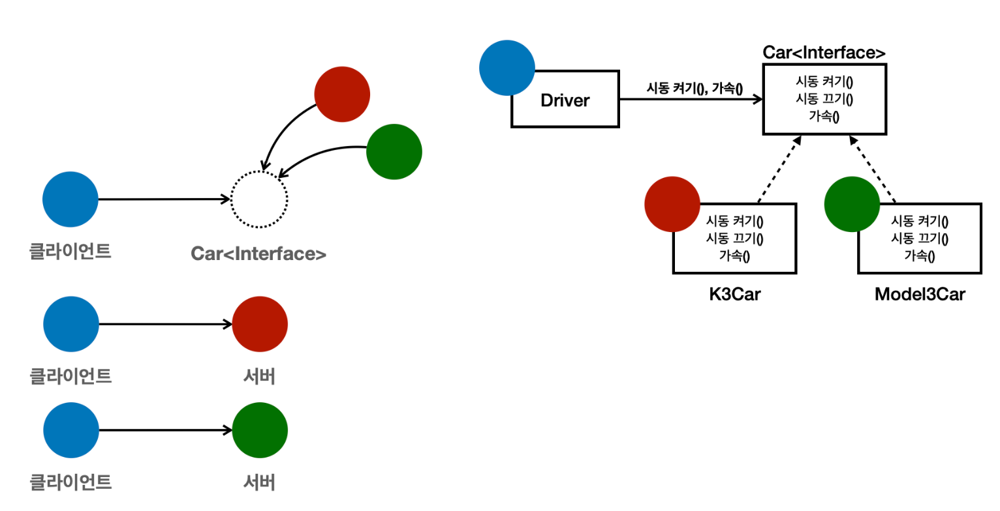

# 좋은 객체 지향 프로그래밍이란?

## 객체 지향의 특징
- 추상화
- 캡슐화
- 상속
- 다형성

## 객체 지향 프로그래밍
- 컴퓨터 프로그램을 명령어의 목록으로 보는 시각에서 벗어나 여러개의 독립된 단위, 즉 **객체들의 모임**으로 파악하고자 하는 것이다. 
- 각각의 객체는 메세지를 주고받고, 데이터를 처리할 수 있다.
- 프로그램을 **유연**하고 **변경이 용이**하게 만들기 때문에 대규모 프로젝트 개발에 많이 사용된다.

### 다형성의 실세계 비유
- 실세계와 객체 지향을 1:1로 매칭 X
- **역할과 구현**으로 세상을 구분한다.

#### 예시

> 운전자(역할)와 자동차(역할)

자동차 역할의 인터페이스를 따라서 다양한 자동차 종류를 구현할 수 있다.

자동차의 **_역할 / 구현을 분리하였다._**

클라이언트(운전자 역할) 자동차의 모든 동작 방식을 이해할 필요는 없다.  
단지 자동차의 역할을 알고 사용할 수 있으면 된다.

자동차의 내부 구현 방식에 변화가 생겨도 클라이언트는 영향을 받지 않는다.

즉, 클라이언트는 대상의 역할(인터페이스)만 알면 된다.

클라이언트는 구현 대상 자체를 변경해도 영향받지 않는다.

# 역할과 구현을 분리 - 자바 언어
- 자바 언어의 다형성을 활용
  - 역할 = 인터페이스
  - 구현 = 인터페이스를 구현한 클래스, 구현 객체
- 객체를 설계할 때 역할과 구현을 명확히 분리
- 객체 설계 시 역할(인터페이스)를 먼저 부여하고, 그 역할을 수행하는 구현 객체 만들기

다형성으로 인터페이스를 구현한 객체 => Car 인터페이스 사용

자식인 객체만 담아서 사용할 수 있다.

클라이언트는 인터페이스로만 호출했지만 자식에 오버라이딩 된 메서드를 호출해 사용할 수 있다.

## 다형성의 본질

- 인터페이스를 구현한 객체 인스턴스를 **실행 시점에 유연하게 변경할 수 있다.**
- **클라이언트를 변경하지 않고, 서버의 구현 기능을 유연하게 변경할 수 있다.**

## 정리

- 실세계의 역할과 구현이라는 편리한 컨셉을 다형성을 통해 객체 세상으로 가져올 수 있음
- 유연하고, 변경 용이
- 확장 가능한 설계
- 클라이언트에게 영향을 주지 않는 변경 기능
- 인터페이스를 안정적으로 설계하는 것이 중요

## 한계

- 역할(인터페이스) 자체가 변하면, 클라이언트, 서버 모두에 큰 변경이 발생한다.
  - 인터페이스를 안정적으로 잘 설게하는 것이 중요하다 !!
  - 나아가 api 설계 시에도 변경을 적게 하기 위해 안정적 설계가 중요

# 정리

- 다형성이 가장 중요하다!
- 디자인 패턴 대부분은 다형성을 활용하는 것이다.
- 스프링의 핵심인 제어의 역전(IoC), 의존관계 주입(DI)도 결국 다형성을 활용하는 것이다.
- 다형성을 잘 활용하면 마치 레고 블럭 조립하듯이 구현을 편리하게 변경할 수 있다.